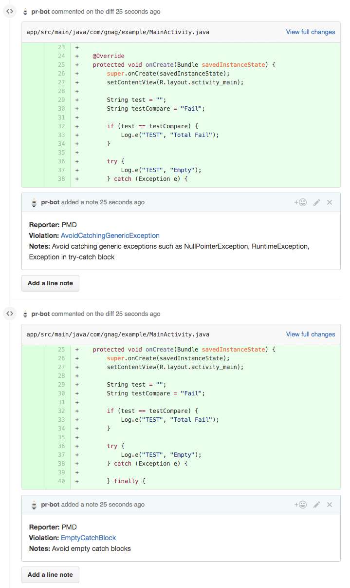
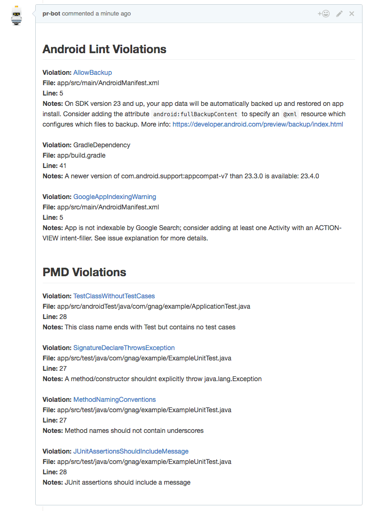

# Gnag <a href="https://travis-ci.org/btkelly/gnag"></a> [](https://coveralls.io/github/btkelly/gnag?branch=master) <a href="http://www.detroitlabs.com/"></a> <a href='https://bintray.com/btkelly/maven/gnag-gradle-plugin/_latestVersion'></a> [](https://android-arsenal.com/details/1/3128)
Gnag is a Gradle plugin that helps facilitate GitHub PR checking and automatic commenting of violations for Android projects.

It can be used in Java-only, Kotlin-only, and mixed Java/Kotlin codebases.

The name is a portmanteau of the words ["Gradle"](https://gradle.org/) and ["nag"](https://en.wiktionary.org/wiki/nag#Verb). The first "g" is silent!

## Example Output

Below are examples of output posted to a GitHub PR on a project using Gnag to enforce quality checks.

Violations associated with a specific line in your PR will be posted as comments **on that line**:



Violations that are not associated with a specific line in your PR will be aggregated and posted in a **single top-level PR comment**:



## Usage

**Requires JDK 12 or Higher**

Gnag is meant to be simple to use and easy to drop in to any JVM based project. Shown below is the simplest
Gnag setup that will report violations to GitHub. By default this config will report PMD, Checkstyle, ktlint, detekt and
Android Lint to GitHub.

<details open>
<summary><b>build.gradle (Groovy)</b></summary>

```groovy
plugins {
  id "com.btkelly.gnag" version "{current version}"
}

gnag {
    github {
        repoName 'btkelly/repo'
        authToken '0000000000000'
        issueNumber '1'
    }
}
```

</details>

<details>
<summary><b>build.gradle.kts (Kotlin)</b></summary>

```kotlin
plugins {
  id("com.btkelly.gnag") version "{current version}"
}

gnag {
    github {
        repoName("btkelly/repo")
        authToken("0000000000000")
        issueNumber("1")
    }
}
```

</details>

This is the simplest way to add automatic PR checking and commenting to your project. The options defined in the `github` closure can be overridden by passing command line parameters with the same name to your build. This is helpful when using in conjunction with a CI system to allow automated builds.

### Tasks

You can use the gnagCheck gradle task to run Gnag locally and generate an HTML report in the build directory.
```groovy
./gradlew clean gnagCheck
```

You can use the gnagReport task which will first run gnagCheck and then report detected violations to the GitHub issue specified.
In this example the issue number and authtoken for the comment user are passed as commandline arguments.
```groovy
./gradlew clean gnagReport -PissueNumber=11 -PauthToken=iu2n3iu2nfjknfjk23nfkj23nk
```

### Customization
<details open>
<summary><b>build.gradle (Groovy)</b></summary>

```groovy
gnag {
    enabled true
    failOnError true

    checkstyle {
        enabled true
        toolVersion "8.45.1"
        reporterConfig project.file('config/checkstyle.xml')
    }

    pmd {
        enabled true
        toolVersion "6.22.0"
        reporterConfig project.file('config/pmd.xml')
    }

    ktlint {
        enabled true
        toolVersion "0.42.0"
    }

    detekt {
        enabled true
        reporterConfig project.file('config/detekt.yml')
        toolVersion "1.17.1"
    }

    androidLint {
        enabled true
        severity 'Error'
    }

    github {
        rootUrl 'https://my.githubinstall.com/repos/'
        repoName 'btkelly/repo'
        authToken '0000000000000'
        issueNumber '1'
        setCommentInline true
        setCommentOnSuccess true
        useGitHubStatuses true
    }
}
```

</details>

<details>
<summary><b>build.gradle.kts (Kotlin)</b></summary>

```kotlin
gnag {
    isEnabled = true
    setFailOnError(true)

    checkstyle {
        isEnabled = true
        toolVersion("8.45.1")
        reporterConfig(project.file("config/checkstyle.xml"))
    }

    pmd {
        isEnabled = true
        toolVersion("6.22.0")
        reporterConfig(project.file("config/pmd.xml"))
    }

    ktlint {
        isEnabled = true
        toolVersion("0.35.0")
    }

    detekt {
        isEnabled = true
        reporterConfig(project.file("config/detekt.yml"))
    }

    androidLint {
        isEnabled = true
        severity("Error")
    }

    github {
        rootUrl("https://my.githubinstall.com/repos/")
        repoName("btkelly/repo")
        authToken("0000000000000")
        issueNumber("1")
        setCommentInline(true)
        setCommentOnSuccess(true)
        useGitHubStatuses(true)
    }
}
```

</details>

***NOTE:*** All reporters are enabled by default

- ***enabled*** - easily disable Gnag in specific situations
- ***failOnError*** - should violations cause the build to fail or just generate a report; if set to false, you may need to add the following to prevent your build still failing from Android Lint errors:

    <details open>
    <summary><b>build.gradle (Groovy)</b></summary>

    ```
    android {
        lintOptions {
            abortOnError false
        }
    }
    ```

    </details>

    <details>
    <summary><b>build.gradle.kts (Kotlin)</b></summary>

    ```
    android {
        lintOptions {
            abortOnError(false)
        }
    }
    ```

    </details>

- ***checkstyle*** - block to customize the checkstyle reporter
  - ***enabled*** - set if checkstyle should execute
  - ***toolVersion*** - override the checkstyle version
  - ***reporterConfig*** - provide a custom [checkstyle config](http://checkstyle.sourceforge.net/config.html) (see the default config [here](/plugin/src/main/resources/checkstyle.xml))
- ***pmd*** - block to customize the PMD reporter
  - ***enabled*** - set if PMD should execute
  - ***toolVersion*** - override the PMD version
  - ***reporterConfig*** - provide a custom [PMD config](http://pmd.sourceforge.net/pmd-5.1.1/howtomakearuleset.html) (see the default config [here](/plugin/src/main/resources/pmd.xml))
- ***ktlint*** - block to customize the ktlint reporter
  - ***enabled*** - set if ktlint should execute
  - ***toolVersion*** - override the ktlint version
- ***detekt*** - block to customize the detekt reporter
  - ***enabled*** - set if detekt should execute
  - ***reporterConfig*** - provide a custom [detekt config](https://arturbosch.github.io/detekt/configurations.html)
  - ***toolVersion*** - override the detekt version
- ***androidLint*** - block to customize the android lint reporter
  - ***enabled*** - set if the android lint reporter should look for a lint report
  - ***severity*** - can be 'Error' or 'Warning' (case insensitive) depending on which severity you want Gnag to check
- ***github*** - block to customize GitHub reporting (only used during the `gnagReport` task
  - ***rootUrl*** - root URL to use when communicating with the GitHub API (must include trailing slash), if not provided will default to "https://api.github.com/repos/"
  - ***repoName*** - account and repo name to report violations to
  - ***authToken*** - a GitHub token for a user that has access to comment on issues to the specified repo
  - ***issueNumber*** - the issue or PR number currently being built
  - ***setCommentInline*** - whether or not comments posted to GitHub should be placed inline where possible
  - ***setCommentOnSuccess*** - whether or not a comment should be posted to GitHub when no violations exist
  - ***useGitHubStatuses*** - should report GitHub status on each module in the PR or just fail if ***failOnError*** enabled

### Multi-Module Projects

To enforce the same quality checks across multiple Gradle modules, apply and configure Gnag in your root `build.gradle` file as follows (you can remove the equivalent code from submobule `build.gradle` files):

<details open>
<summary><b>build.gradle (Groovy)</b></summary>

```groovy
plugins {
  id "com.btkelly.gnag" version "{current version}" apply false
}

subprojects {
    plugins {
      id "com.btkelly.gnag"
    }

    gnag {
        // Standard Gnag configuration goes here.
        //
        // Reference tool configuration files using the rootProject:
        //   reporterConfig rootProject.file('config/toolrules.xml')
    }
}
```

</details>

<details>
<summary><b>build.gradle.kts (Kotlin)</b></summary>

```kotlin
plugins {
  id("com.btkelly.gnag") version "{current version}" apply false
}

subprojects {
    plugins {
      id("com.btkelly.gnag")
    }

    configure<com.btkelly.gnag.extensions.GnagPluginExtension> {
        // Standard Gnag configuration goes here.
        //
        // Reference tool configuration files using the rootProject:
        //   reporterConfig(rootProject.file("config/toolrules.xml"))
    }
}

```

</details>

You may need to keep the Android lint portions of your configuration in submodule `build.gradle` files if your project includes non-Android submodules. In this case, you should also use the `rootProject` to reference any shared lint configuration file.

## Example [Travis CI](http://travis-ci.org) Usage

Travis is a continuous integration service and is free for open source projects. Below is an example of how to configure Gnag to run on Travis.

You must set an environment variable on your Travis instance for the `PR_BOT_AUTH_TOKEN` used to post comments back to GitHub.

***.travis.yml***

```yml
language: android
android:
  components:
  - platform-tools
  - tools
  - build-tools-25.0.3
  - android-25
jdk:
  - openjdk8
branches:
  only:
  - master
script: "./travis-build.sh"
```

***travis-build.sh***

```bash
#!/bin/bash
set -ev

if [ "${TRAVIS_PULL_REQUEST}" = "false" ]; then
	./gradlew clean gnagCheck
else
	./gradlew clean gnagReport -PauthToken="${PR_BOT_AUTH_TOKEN}" -PissueNumber="${TRAVIS_PULL_REQUEST}"
fi
```

## License

```
Copyright 2016 Bryan Kelly

Licensed under the Apache License, Version 2.0 (the "License");
you may not use this file except in compliance with the License.
You may obtain a copy of the License at

   http://www.apache.org/licenses/LICENSE-2.0

Unless required by applicable law or agreed to in writing, software
distributed under the License is distributed on an "AS IS" BASIS,
WITHOUT WARRANTIES OR CONDITIONS OF ANY KIND, either express or implied.
See the License for the specific language governing permissions and
limitations under the License.
```